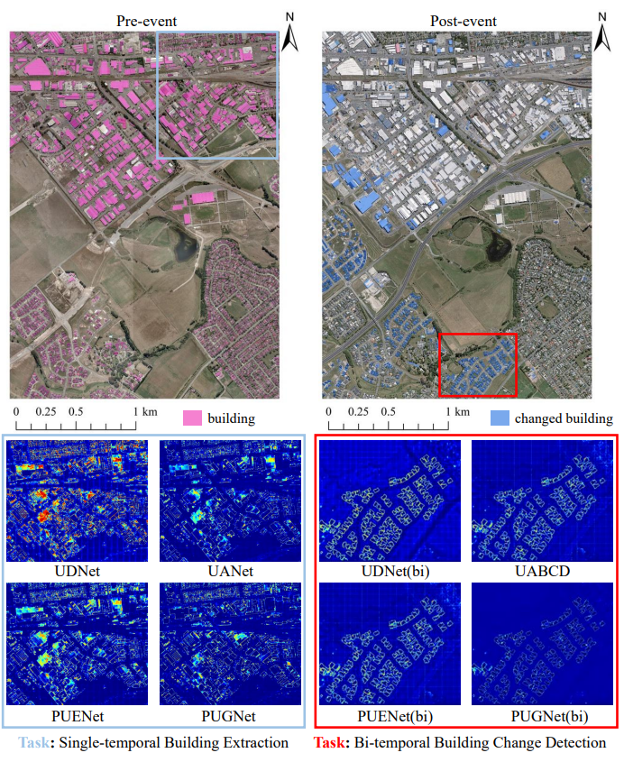
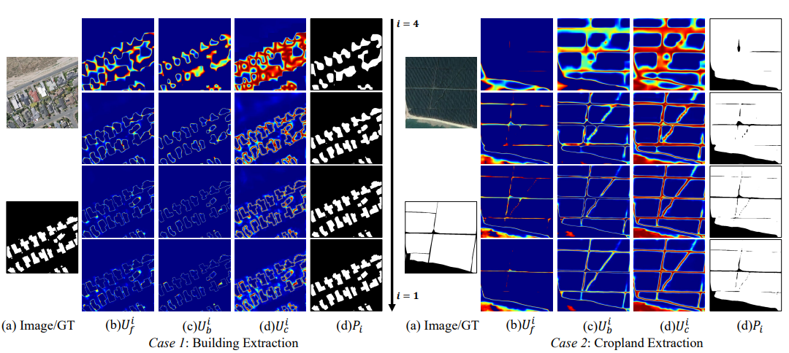

# PU_RS
The official implement of 《Progressive Uncertainty-Guided Network for Binary Segmentation in High-Resolution Remote Sensing Imagery》
 
> ⏳ **Full Implementation Release Coming Soon**: We are actively finalizing the complete implementation, which will include **training scripts**, **testing procedures**, and a **large-scale inference framework**. Stay tuned for updates!
 

  <em>Visual comparison of uncertainty between PUGNet and other state-of-the-art methods.</em>

## Visual Results for Multiple Tasks

We have released visual results for various tasks. You can access them from the following links:

### Single-temporal Building Extraction 

**WHU Building Dataset**:[Download](https://pan.baidu.com/s/15dKsS3MfQeUu0Vbe2xKZHQ?pwd=PUGN)

**Massachusetts Building Dataset**:[Download](https://pan.baidu.com/s/1uo0tQcIrxCPOoph83Ceg9w?pwd=PUGN)

**Inria Aerial Image Labeling Dataset**:[Download](https://pan.baidu.com/s/1-d_vFV_fcLHtrgnIXPAVFg?pwd=PUGN)

### Single-temporal Cropland Extraction 

**Fine-Grained Farmland Dataset**:[Download](https://pan.baidu.com/s/1453MzPBGGXMRVKjPxqAlKQ?pwd=PUGN)

### Bi-temporal Building Change Detection

**LEVIR-CD Dataset**:[Download](https://pan.baidu.com/s/1CM8U2D9wIPD50hhhDrc3UA?pwd=PUGN)

**SYSU-CD Dataset**:[Download](https://pan.baidu.com/s/1oaaRpPx7mYTfXGgJJOEajw?pwd=PUGN)

**Lebedev Dataset**:[Download](https://pan.baidu.com/s/1JmgYZXXWsU_6xfnO3tKApA?pwd=xnhz)

## Uncertainty  Decomposition

  

